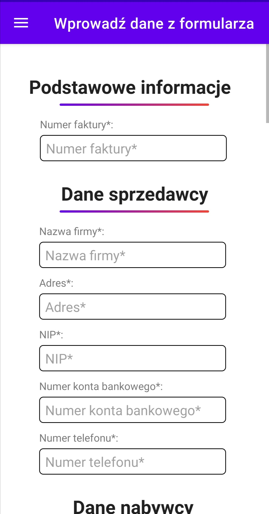
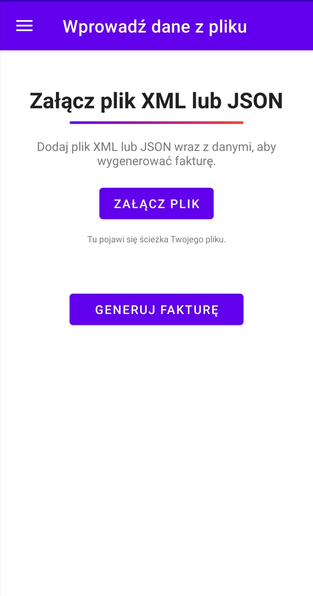

# 🧾 InvoiceGenius

**Welcome to InvoiceGenius — your streamlined solution for fast, accurate, and professional invoice generation.**  
Save time, reduce errors, and keep your finances organized with a simple and intuitive Android interface.

---

## ✨ Features

- ✅ **Quick Invoice Creation**  
  Effortlessly create and customize invoices using a sleek UI.

- ✅ **Form-Based Input**  
  Use a clean, structured form to input invoice data manually.

- ✅ **Import from JSON/XML Files**  
  Speed up invoicing by uploading structured data from external files.

---

## 🖼️ Application Screens

### 🏠 Home Page

<kbd>  
  
</kbd>

- `ConstraintLayout`-based responsive design
- **Logo:** 150x150 dp, centered, 136 dp from the top
- **App Name:** Bold `TextView`, 40sp, 28 dp below logo
- **Separator:** 300x3 dp `View` with gradient background
- **Slogan:** Centered, 18sp, 16 dp below separator

---

### 📋 Navigation Menu

<kbd>  
  
</kbd>

- 🏠 **Home Page**
- 📝 **Enter data from form**
- 📎 **Enter data from file**

Each option includes a relevant icon for better usability.

---

## 📑 Data Entry Interfaces

### 🧾 Form-Based Entry

<kbd>  
  
</kbd>

- 10 `LinearLayout` containers for entering invoice data
- "Generate Invoice" `Button` triggers the invoice activity

---

### 📁 File Attachment

<kbd>  
  
</kbd>

- **Attach File Button:** Allows uploading `.json` or `.xml` files  
- **Generate Button:** Triggers invoice generation from uploaded data

---

## 🧠 Business Logic Overview

### 🧩 FileFragment.kt

Handles file selection, validation, and data processing.

**Key Methods:**
```kotlin
chooseFile() // Starts file chooser
validateAndDisplayFilePath(uri) // Checks file extension
readFileContent(uri, extension) // Parses XML or JSON
displayData(dataMap) // Shows content in a dialog
```

---

### 🧾 FormFragment.kt

Manages the invoice creation form.

**Key Methods:**
```kotlin
validateForm() // Validates input
showErrors(errors) // Displays errors
getProduct() // Constructs a product object
```

---

### 🏡 HomeFragment.kt

Empty fragment for now, placeholder for future features.

---

## 📦 Data Model

### 🧍 Buyer.kt

```kotlin
data class Buyer(
    val companyName: String,
    val address: String,
    val email: String,
    val phoneNumber: String
)
```

---

### 🧍‍♂️ Seller.kt

```kotlin
data class Seller(
    val companyName: String,
    val address: String,
    val nip: String,
    val bankAccountNumber: String,
    val phoneNumber: String
)
```

---

### 📦 Product.kt

```kotlin
data class Product(
    val productName: String,
    val productAmount: Int,
    val productMeasure: String,
    val productPriceNetto: Double,
    val vatRate: Double
)
```

---

### 🧾 InvoiceData.kt

```kotlin
data class InvoiceData(
    val seller: Seller,
    val buyer: Buyer,
    val sellDate: String,
    val issueDate: String,
    val paymentMethod: String,
    val paymentDate: String,
    val paymentTargetDate: String,
    val products: List<Product>,
    val invoiceNumber: String
)
```

---

## 🧾 Invoice Template Layout

| Section       | Details                                                                 |
|---------------|-------------------------------------------------------------------------|
| **Header**    | Invoice Number, Issue Date, Sale Date                                  |
| **Seller**    | Company Name, Address, VAT, Phone, Bank Account                        |
| **Buyer**     | Company Name, Address, Email, Phone                                     |
| **Products**  | Table with Name, Quantity, UoM, Net Price, VAT %, VAT, Gross Price     |
| **Summary**   | Totals for Net, VAT, and Gross prices                                   |
| **Payment**   | Method, Deadline, and Total to Pay                                      |
| **Signatures**| Seller and Buyer signature fields                                       |
| **Footer**    | "Invoice generated by InvoiceGenius"                                    |

---

### 📲 InvoiceActivity.kt

Displays final invoice data using Intent.

**Key Elements Rendered:**

- `invoiceNumberTemp`, `issueDateTemp`, `sellDateTemp`
- Seller & Buyer text fields
- Product list in `productsContainer`
- Summary totals and payment info
- Signature placeholders

---

## ✅ Permissions

> 🔐 **Required Permission:**  
> `READ_EXTERNAL_STORAGE` for file import functionality.

---

## 🏁 Conclusion

**InvoiceGenius** makes creating and managing invoices simple, fast, and professional.  
Whether you're entering data manually or uploading structured files, the process is seamless.

> 📈 Designed for small to medium-sized businesses seeking clarity, control, and speed in invoicing.

---
